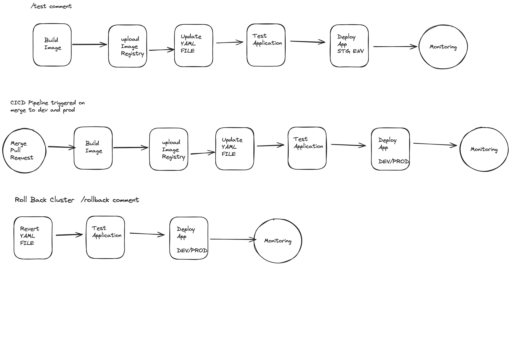

# TAKE HOME ASSIGNMENT OUTLINE
On GCP create a CICD pipeline for a microservice application, make it scalable, embedd monitoring and logging solutions and automate as much as possible 
* use a CI tool such as Github Actions 
* build a docker image in CI pipeline 
* rollout to kubernetes with CD in a way that minimizes risk/downtime
* showcase monitoring and logging to detect issues 
* Describe security considerations 
* verbose readme documenting design decisions 
* consider this a production grade deployment 

# Design Decisions 
## Web Application Choice
For this take home assignment we will use microservices demo provided by GCP as its built around GCP, has several microservices and a Database (Redis only in this case) 

Kubernetes yaml files are already provided as well as necessary terraform files to spin up our instances in GCP, however to save on cloud billing as I am doing this on my own account we may need to make some tweaks to avoid a large bill.

## CICD pipeline 

### Branching strategy
For our Git Repo we will have the following branching strategy 
* Feature (local/STG testing)
* Dev  (rollout to dev)
* Master (rollout to production)

For the purpose of this assignment lets either have dev and prod in the same namespace or just demonstrate the pipeline rolling out to DEV in order to save on billing.

## Choice of Products 
My overall goal is to leverage free tiers and free GCP credits to hopefully not spend any money or at the very least minimize it 
### Kubernetes/GKE 
 Autopilot mode, Free tier 
 The GKE free tier provides $74.40 in monthly credits per billing account that are applied to zonal and Autopilot clusters.
 https://cloud.google.com/kubernetes-engine?hl=en#pricing 

 In a real production you might need to consider multizonal Kubernetes clusters or Kubernetes clusters in different regions with Loadbalancer directing traffic to the instance that is geographically closer, failover environments, disaster recovery etc.

### Memstore/Redis 
Basic (no read replicas & cheapest tier)
in this Redis is not free for basic tier however I should be able to get some free credits to cover 
https://cloud.google.com/memorystore/docs/redis/pricing 

### Monitoring 
GKE has monitoring setup by default, you could setup istion monitoring as well however that will impact billing  https://cloud.google.com/kubernetes-engine/docs/how-to/configure-metrics
Same with Memstore  https://cloud.google.com/memorystore/docs/redis/monitor-instances

In a production environment you would most likely want to optimize retention and archive data for analytical purposes as well

### Logging 
GKE also logs by default for:
* system logs 
* application logs 
* audit logs 
you can also enable other kinds of logs e.g. APISERVER logs but in this case lets ignore them however in a real cluster you would probably want this to troubleshoot controlplane issues
 https://cloud.google.com/kubernetes-engine/docs/concepts/about-logs

In a production environment you would most likely want to backup your important logs in Cloud Storage for retention and analytical purposes which could then be analyzed in BigQuery

### CICD Tooling
GCP provides tooling for CICD, as we are using Github lets stick to Github Actions as our CI tool to keep things simple.
We could use a CD tool such as a CNCF project like Flux or ArgoCD or we could use Cloud Deployment manager a solution provided by GCP, while convient it does introduce vendor lock in, if you wanted to go multi cloud in the future.
https://cloud.google.com/architecture/app-development-and-delivery-with-cloud-code-gcb-cd-and-gke 

While there are already workflows defined within this repo they run on self hosted runners meaning we cannot use them as is. To Keep things 

### security considerations 
This is GCP project is owned by me and I am the sole owner of the project. When adding other developers it is important to assign permissions with least priveledge. If developers are working on GKE only do not allow them permissions to edit the VPC or memstore configuration. 

These permissions can also be integrated within GKE e.g. only certain developers can make changes to certain namespaces or resources, for example if we have a QA team they should only be allowed to access a QA cluster/namespace and not our live production namespace.

Additionally it is wise to shift to Zero touch production if possible and grant permission to directly touch production only when absolutely necessary. For example all changes are rolled out by CICD pipelines rather than by an individual.

## Steps 
1. Setup GCP Account  (billing, budgets, free tier)
 FREE TRIAL $300 USD = No Billing 
2. Setup infra (terraform)
3. Setup CI (Github Actions)
4. Setup CD 
5. Demo Rollout (Merge to main)
6. Demo Logging 
7. Demo monitoring 