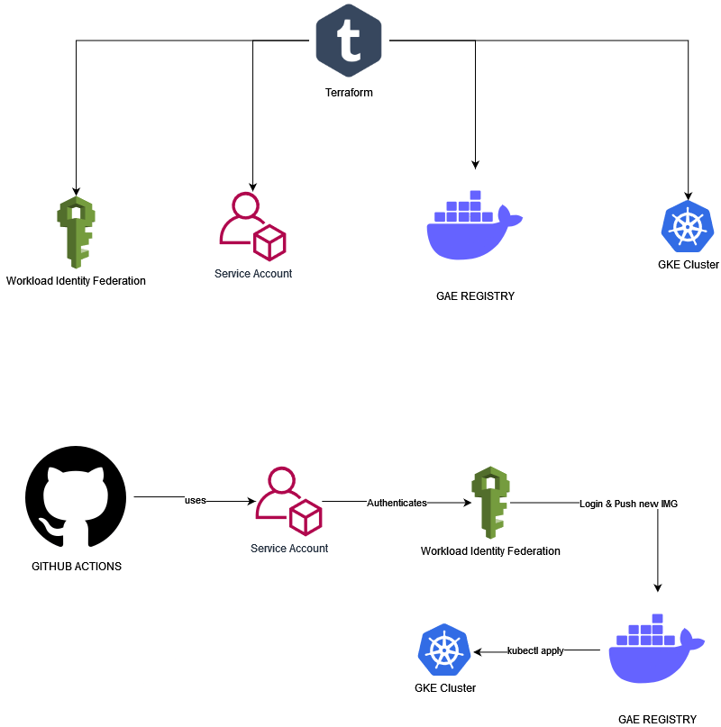
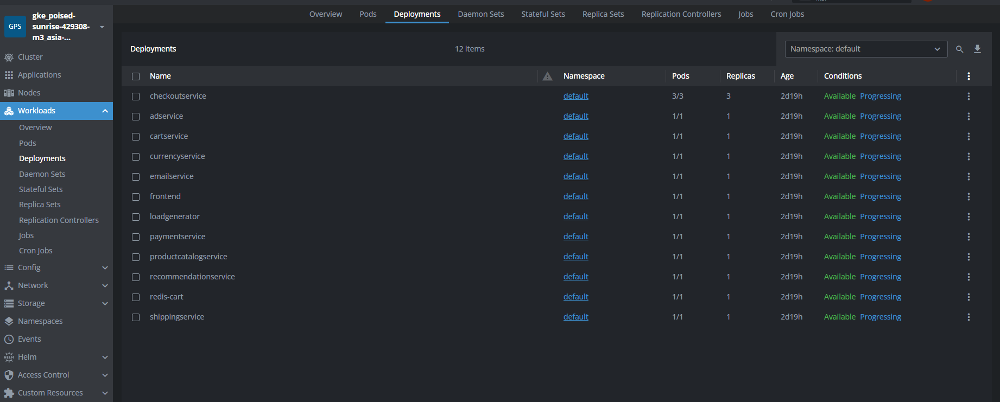
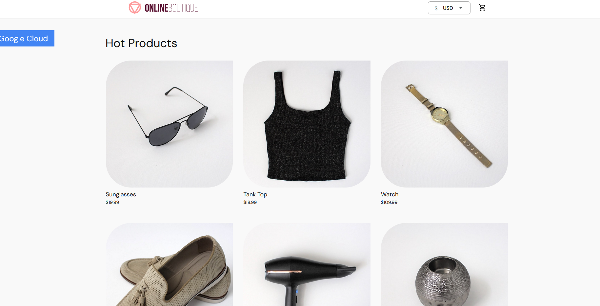
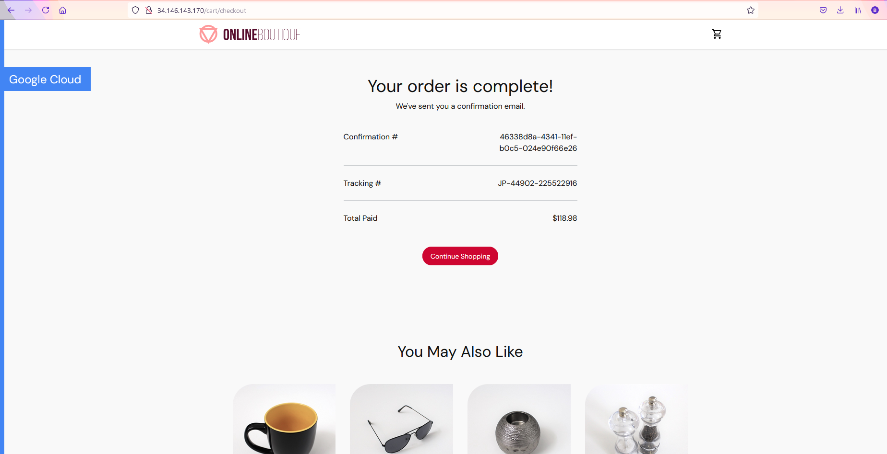
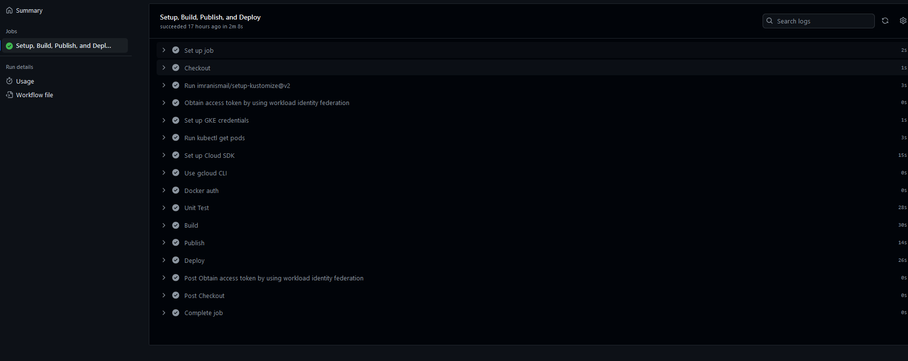
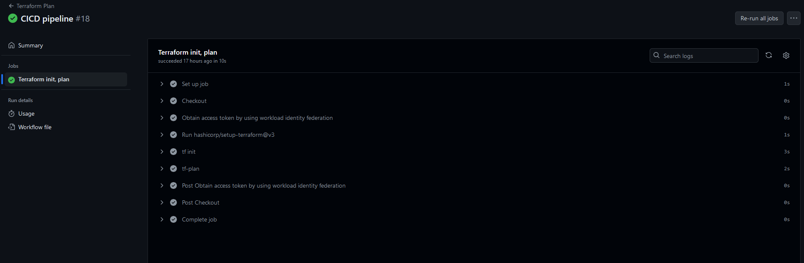
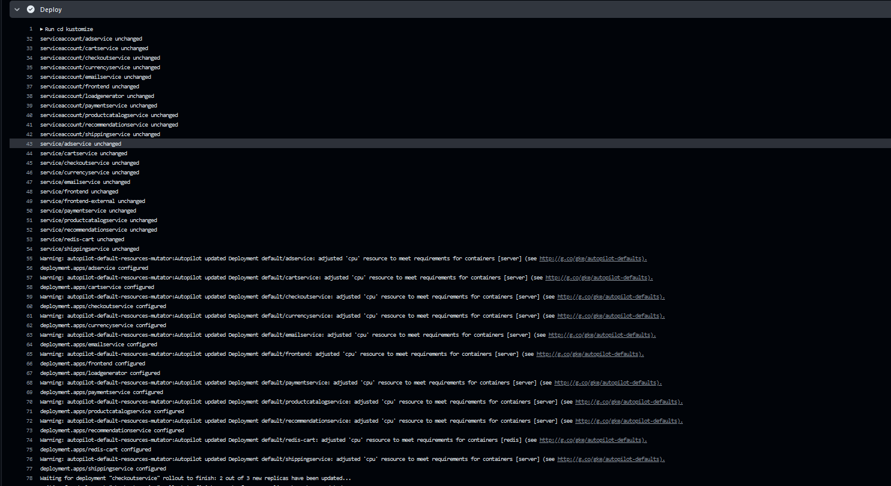
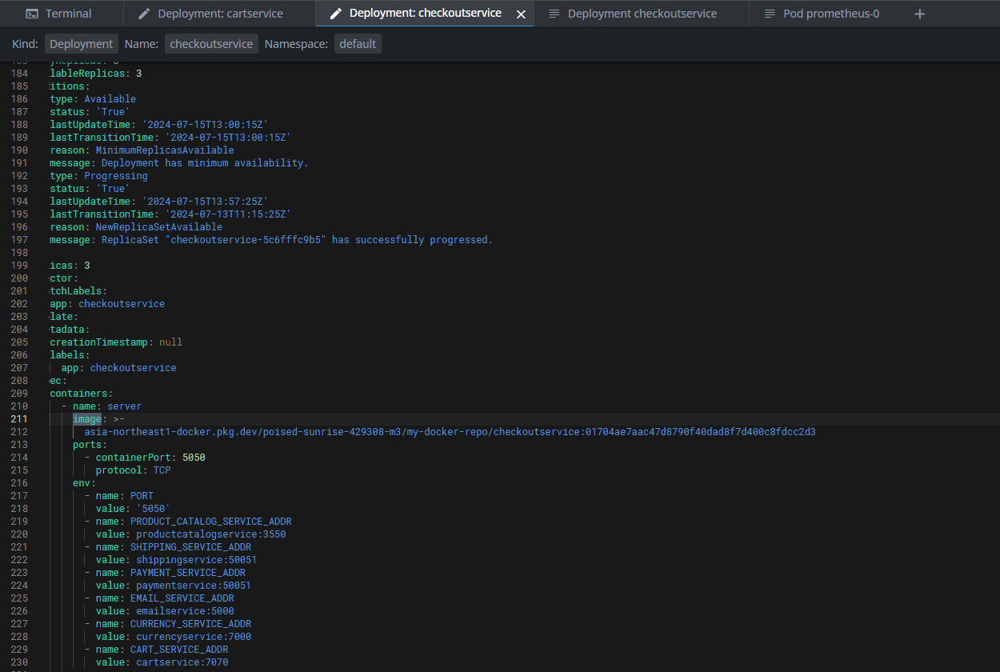
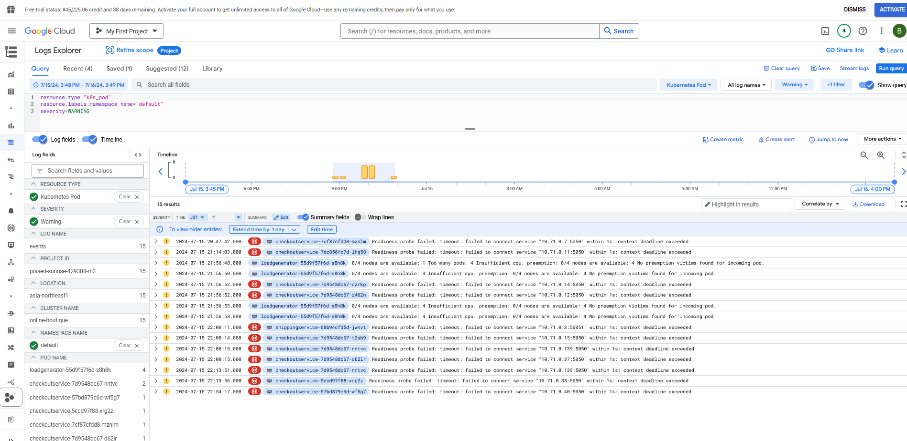
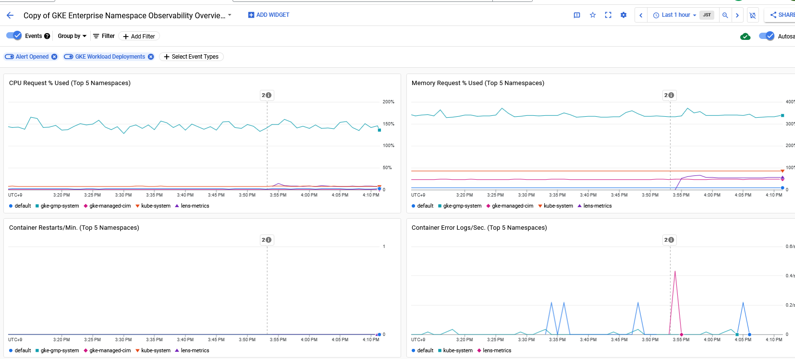

# TAKE HOME ASSIGNMENT OUTLINE
On GCP create a CICD pipeline for a microservice application, make it scalable, embedd monitoring and logging solutions and automate as much as possible 
* use a CI tool such as Github Actions 
* build a docker image in CI pipeline 
* rollout to kubernetes with CD in a way that minimizes risk/downtime
* showcase monitoring and logging to detect issues 
* Describe security considerations 
* verbose readme documenting design decisions 
* consider this a production grade deployment 

# Architectural Diagram
 

# Design Decisions 
## Minimize Downtime 
Kubernetes has several Update strategies in our case to keep thing simple we will go with Rolling update and set replicas to 3 to ensure HA
```
spec:
  replicas: 3 
  strategy:
    type: RollingUpdate
    rollingUpdate:
       maxUnavailable: 1
```

## Web Application Choice
For this take home assignment we will use microservices demo provided by GCP as its built around GCP, has several microservices and a Database (Redis) 

Kubernetes yaml files are already provided as well as necessary terraform files to create GKE and Redis deployments however we will need to add additional credentials for Google Artifact Repository, Workload Identity Manager & Service Account + Roles

Since this repo has many different applications in it we will only focus on 1 application checkoutservice for the CICD pipeline but we will deploy them all to access our application. We will also need to tag the image and push it to our repo.

## CICD pipeline 
Utilizing Github Actions and adding workload identity federation we can connect to our GCP project and push images, deploy it to the cluster

First we install Kustomize and authenticate against GCP and ensure we can connect to GAR and GKE, we then run our unit tests, build and upload our image and roll it out on the new cluster  by patching the yaml file with kustomize and kubectl apply 

At this stage we are keeping things simple with Github Actions handling both CI/CD, rollout would simply be either 
```
 kubectl rollout history deployment/checkoutservice
 kubectl rollout undo deployment/checkoutservice --to-revision=2
```
or Reverting the commit and allowing the CICD pipeline to build a new image with the old config 

For larger projects we may want to consider a tool such as argoCD or Flux which operates locally within a kubernetes cluster and provides rollbacks, built in monitoring dashboards, multi cluster orchestration, multi-tenancy, support for blue-green deployments. 

We could create a worklow for terraform as well

### Branching strategy
For this assignment to save on time we will just have CICD deploy when commited to master although in a real environment we would want to consider splitting our branches to reflect QA, DEV & PROD environment. So that a CICD pipeline is deployed on pushes to QA, DEV and PROD branches and deploys it to to each environment with PROD being the last one.


## Choice of Products 
My overall goal is to leverage free tiers and free GCP credits to hopefully not spend any money 
### Kubernetes/GKE 
 Autopilot mode, Free tier 
 The GKE free tier provides $74.40 in monthly credits per billing account that are applied to zonal and Autopilot clusters.
 https://cloud.google.com/kubernetes-engine?hl=en#pricing 

 In a real production you might need to consider multizonal Kubernetes clusters or Kubernetes clusters in different regions with Loadbalancer directing traffic to the instance that is geographically closer, failover environments, disaster recovery etc.

### Memstore/Redis 
Basic (no read replicas & cheapest tier)  lets disable this for now as key is to demonstrate GKE/CICD knowledge
https://cloud.google.com/memorystore/docs/redis/pricing 

### Monitoring 
GKE has monitoring setup by default, you could setup istion monitoring as well however that will impact billing  https://cloud.google.com/kubernetes-engine/docs/how-to/configure-metrics
Same with Memstore  https://cloud.google.com/memorystore/docs/redis/monitor-instances

In a production environment you would most likely want to optimize retention and archive data for analytical purposes as well e.g. sending backups to Cloud Storage


### Logging 
GKE also logs by default for:
* system logs 
* application logs 
* audit logs 
you can also enable other kinds of logs e.g. APISERVER logs but in this case lets ignore them however in a real cluster you would probably want this to troubleshoot controlplane issues
 https://cloud.google.com/kubernetes-engine/docs/concepts/about-logs

In a production environment you would most likely want to backup your important logs in Cloud Storage for retention and analytical purposes which could then be analyzed in BigQuery


### security considerations 
This is GCP project is owned by me and I am the sole owner of the project. When adding other developers it is important to assign permissions with least priveledge. If developers are working on GKE only do not allow them permissions to edit the VPC or memstore configuration. All users should utilize Roles and IAM authentication to best practice.

These permissions can also be integrated within GKE e.g. only certain developers can make changes to certain namespaces or resources, for example if we have a QA team they should only be allowed to access a QA cluster/namespace and not our live production namespace.

Use github secrets for sensitive information.

We are using workload identity federation to connect Github to GCP so we dont have to worry about service account keys 

Additionally it is wise to shift to Zero touch production if possible and grant permission to directly touch production only when absolutely necessary. For example all changes are rolled out by CICD pipelines rather than by an individual.


## Steps 
### Setup GCP Account
FREE TRIAL $300 USD = No Billing 

### Setup infra (terraform)
We use terraform to provision our infra 
* GKE Cluster (Autopilot)
* Google Artifact Registry (Docker)
* Service Account for Github actions + IAM binding
* IAM workload identity pool & provider (connect Github actions to GCP without any keys)

to deploy tf resources run the following or uncomment terraform apply in github actions pipeline  
```
    cd terraform
    terraform init 
    terraform validate 
    terraform plan 
    terraform apply 
```
your resources will then be setup in GCP 
you will need the following variables from your infra 
```
  PROJECT_ID: XXXX
  PROJECT_NUMBER: XXXX
  GAR_LOCATION: asia-northeast1 
  GKE_CLUSTER: online-boutique 
  GKE_ZONE: asia-northeast1  
  REPOSITORY: my-docker-repo
  IMAGE: checkoutservice
  SERVICE_ACCOUNT: XXXXXX
```
Terraform will automatically apply the microservices kubernetes files to your cluster so everything is good to go 
 

[LINK TO APPLICATION](http://34.146.143.170/)



### Setup CICD (Github Actions)
For CICD we setup two simple pipelines one to deploy infra via terraform and 1 to update the deployment for checkoutservice.

add project ID and Project Number to Github secrets as the information is somewhat sensitive & Service Account

On push to master your Pipelines will run 





### Demo Rollout (Merge to main)
[Github Action Runs](https://github.com/bjw123/GCP-take-home/actions)

[Successful Terraform Pipeline](https://github.com/bjw123/GCP-take-home/actions/runs/9939129882/job/27453068947)

[Successful Deployment Pipeline](https://github.com/bjw123/GCP-take-home/actions/runs/9939129878/job/27453068938)



```
kubectl get deploy checkoutservice -o yaml | grep "image: asia-northeast"
        image: asia-northeast1-docker.pkg.dev/poised-sunrise-429308-m3/my-docker-repo/checkoutservice:46ea2494a17bcee09b68db721437ea5dcbc22aa7
```


### Demo Logging 
[Pod warning logs](https://cloudlogging.app.goo.gl/KzhfH2ZBjCzLxiubA)

Can examine the logs for audit info, as to who applied what change, errors in pods or on infra and setup logging alerts on them.




### Demo monitoring 
[Namespace Observibility Dashboard](https://console.cloud.google.com/monitoring/dashboards/builder/a4e8b420-6d1c-4c1e-a314-3a106b32ea1f;duration=PT1H?project=poised-sunrise-429308-m3)

Already many prebuilt dashboards to monitor cluster health, you could set up alerts e.g. uptime is lower than expected or 0, Rollout Stuck due to pending pods etc.

